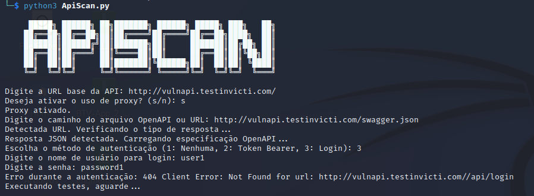
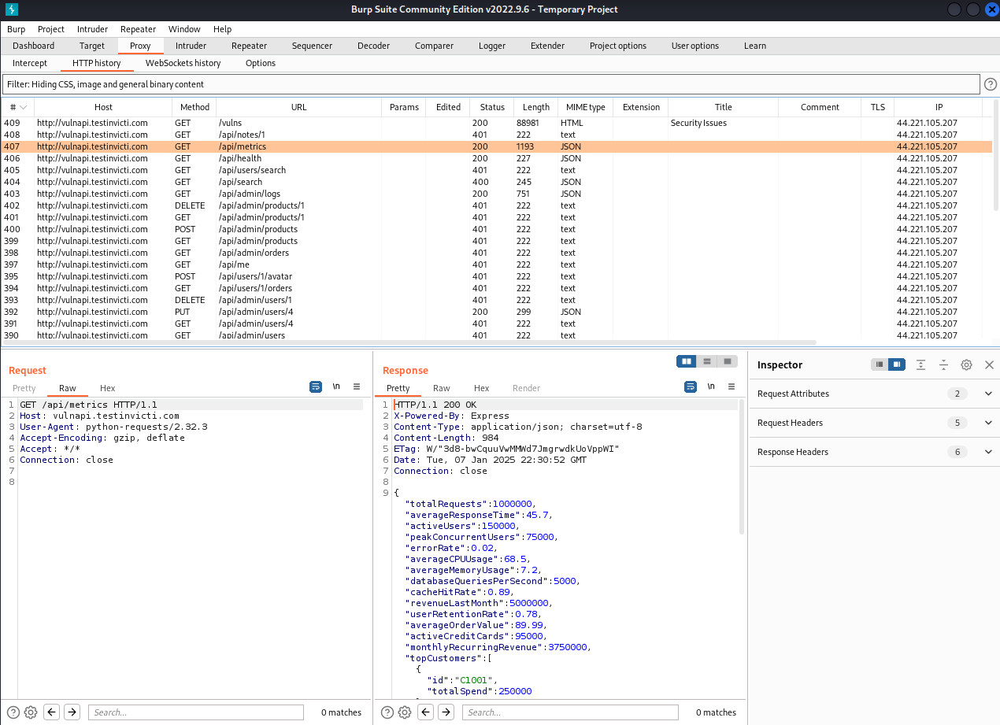
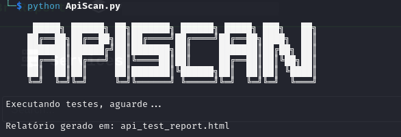

# ApiScan

**ApiScan** é uma ferramenta automatizada projetada para testar a segurança de APIs RESTful. Ela utiliza especificações OpenAPI para identificar endpoints, realizar testes e gerar relatórios detalhados, ajudando a identificar vulnerabilidades com base nas recomendações do OWASP.

---

## Funcionalidades

### 1. Carregamento de Especificação OpenAPI
- Permite importar especificações OpenAPI de um arquivo local ou URL.
- Identifica automaticamente os endpoints para teste.

### 2. Autenticação Personalizável
- Suporte a três métodos de autenticação:
  - Sem autenticação.
  - Token Bearer.
  - Login com credenciais para obter o token automaticamente.

### 3. Testes Automatizados
- Executa chamadas para endpoints definidos, suportando parâmetros em rotas e consultas.
- Gera respostas salvas no arquivo `raw_responses.json`.

### 4. Relatório em HTML
- Usa o script `geraR.py` para criar relatórios personalizados, incluindo:
  - Rotas testadas.
  - Métodos HTTP utilizados.
  - Resumo das respostas brutas.

### 5. Suporte a Proxy
- Compatível com ferramentas como Burp Suite.
- Opção de ativar/desativar proxy durante a execução.

### 6. Scripts de Configuração e Execução
- **setup.sh**: Configura automaticamente o ambiente, instalando dependências necessárias.
- **run.sh**: Facilita a execução da ferramenta com comandos predefinidos.

---

## Novidades da Versão Atual (28/01)

### Melhorias Principais
1. **Relatório Externo:**
   - Relatório HTML gerado pelo script separado `geraR.py`, melhorando modularidade.

2. **Organização do Código:**
   - Estrutura modularizada, separando responsabilidades e facilitando manutenção.

3. **Scripts de Automalização:**
   - **setup.sh** para configuração rápida do ambiente.
   - **run.sh** para execução automatizada da ferramenta.

4. **Salvamento Detalhado:**
   - Respostas brutas dos endpoints salvas para análise posterior.

---

## Como Usar

### 1. Pré-requisitos
- Python 3.x instalado.
- Execute o script de configuração para instalar dependências:
  ```bash
  ./setup.sh
  ```

### 2. Configurar Proxy (opcional)
Para usar Burp Suite ou outra ferramenta intermediária:

```python
PROXIES = {
    "http": "http://127.0.0.1:8080",
    "https": "http://127.0.0.1:8080"
}
USE_PROXY = True  # Ative o proxy conforme necessário.
```

### 3. Executar a Ferramenta
1. Use o script de execução rápida:
   ```bash
   ./run.sh
   ```
   
2. Forneça os parâmetros solicitados:
   - URL base da API.
   - Configuração do proxy (se aplicável).
   - Arquivo ou URL da especificação OpenAPI.
   - Método de autenticação.

3. Geração de Relatório:
   - Após os testes, o `geraR.py` será executado automaticamente.
   - Relatório em HTML será gerado com os resultados detalhados.

---

## Estrutura do Projeto

```
├── reports/            # Diretório onde serão salvos os relatórios
├── ApiScan.py          # Script principal para testes.
├── geraR.py            # Script para geração de relatórios.
├── requirements.txt    # Dependências necessárias.
├── setup.sh            # Script de configuração do ambiente.
├── run.sh              # Script para execução automatizada.
```

---

## Exemplos Visuais

### 1. Configuração Inicial


### 2. Uso do Proxy com Burp Suite


### 3. Relatório Gerado


---

## Contribuição
Contribuições são bem-vindas! Envie sugestões, relatórios de bugs ou melhorias por meio de pull requests.

---

## Referências
- [VulnAPI](http://vulnapi.testinvicti.com/)
- [REST VulnWeb](http://rest.vulnweb.com/docs/#api-GettingStarted-6/)

